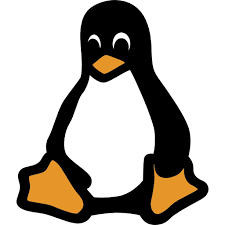

### ✨ About Me
 - ⚡ Embedded System Developer | +11 years of experience 
 - 🌱 I'm currently learning: python
 - 😄 Pronouns: He/Him 

### 🔭  What I am currently working on
 - [Keyfob_firmware](https://github.com/niaraki/keyfob_firmware)
  
### 📫 How to reach me
  E-mail: mohammadniaraki@outlook.com | Linkedin: <a href="https://www.linkedin.com/in/mohammadniaraki/">Mohammad Niaraki</a>

### 📈 My GitHub Status 

  <a href="https://github.com/niaraki">
  
  

### 🔨 Technologies:

 

 
### 💻 My favorite setup
  i3wm | tmux | lunarvim | ubuntu 20.4 lts

<!--
- 🔭 I’m currently working on ...
- 🌱 I’m currently learning ...
- 👯 I’m looking to collaborate on ...
- 🤔 I’m looking for help with ...
- 💬 Ask me about ...
- 📫 How to reach me: ...
- 😄 Pronouns: ...
- ⚡ Fun fact: ...
-->
